

# SHORTORIAL | 모션 인식 기반 댄스 학습 서비스

</img>

숏토리얼은 댄스 챌린지를 중심으로 춤을 연습하고, 촬영하고, SNS에 공유할 수 있는 댄스 학습 서비스입니다.

**2024.04.08 ~ 2024.05.20 (6주)**

**Team. 둠칫둠칫**  
총 6명 (프론트엔드 2, 백엔드 3, AI 1)

# 주요 기능

#### 1. 연습 모드

- 웹캠 또는 핸드폰 카메라를 전신 거울 삼아 언제 어디서든 영상을 보며 춤을 따라 출 수 있습니다.
- 영상의 구간 반복, 배속 변경, 좌우 반전의 기능으로 편리한 연습 환경을 제공합니다.
- 모션 인식을 이용한 유사도 측정으로 점수를 표시해줍니다.
- 모션 인식을 통해 오른손의 위치를 감지하고, 오른손이 카메라상의 버튼 위치에 닿으면 버튼이 활성화되어 기능이 작동합니다.

#### 2. 챌린지 모드

- 챌린지를 촬영하고 저장합니다.
- 촬영된 영상은 마이페이지에서 확인하실 수 있습니다.
- 모션 인식을 통해 오른손의 위치를 감지하고, 오른손이 카메라상의 버튼 위치에 닿으면 버튼이 활성화되어 기능이 작동합니다.

#### 3. 유튜브 공유

- 챌린지 모드에서 저장된 영상은 마이페이지에서 연동된 유튜브 계정으로 게시할 수 있습니다.

# 팀원 소개 & 역할

| 팀원   | 역할      |
| ------ | --------- |
| 우지민 | 팀장, BE  |
| 조민준 | BE, INFRA |
| 전성수 | BE        |
| 김다윤 | FE        |
| 이현정 | AI        |
| 임지은 | FE        |

## Stack

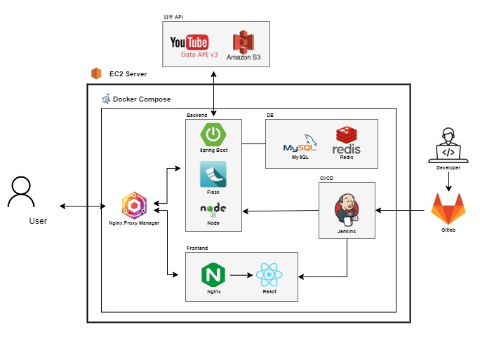

**Environment**  

**BackEnd**  

**Data**

  

 

**FrontEnd**  

**DataBase**  

**Version Control**  

**Deployment**  

**API**  

**Communication**  

# 주요 화면

#### 랜딩 페이지

#### 메인 페이지

- 추천 쇼츠 챌린지, 인기 쇼츠 챌린지, 전체 쇼츠 챌린지
- 쇼츠 상세 정보  
  

#### 연습 모드

- 연습 모드 화면 구성
- 영상을 일정 시간마다 나누어 여러 구간으로 표시
- 구간 반복, 거울 모드(좌우 반전), 배속 변경 기능 사용 가능  
  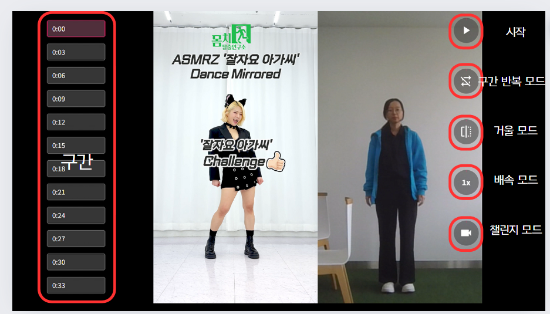

- 모션 인식을 활용한 버튼 클릭  
  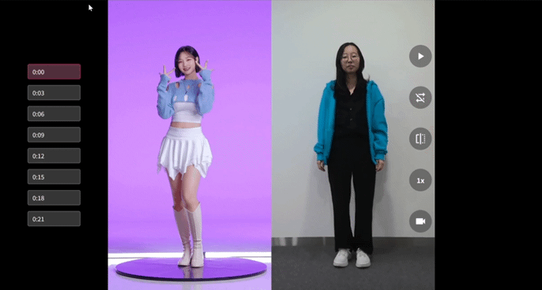

- 손 제스처로 구간 이동  
  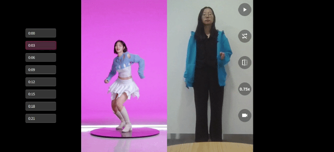

- 구간마다 포즈 유사도 점수 표시  
  

#### 챌린지 모드

- 챌린지 모드 화면 구성
- 영상 녹화 가능
- 타이머, 거울 모드(좌우 반전) 기능 사용 가능  
  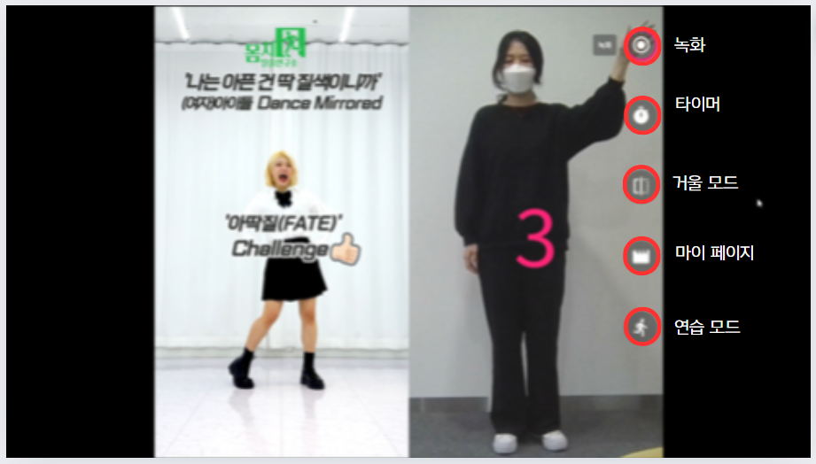

- 모션 인식을 활용한 버튼 클릭  
  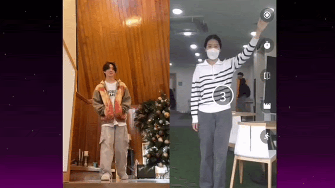

- 녹화 후 영상 저장  
  

#### 마이 페이지

- 촬영한 영상과 시도한 영상 확인  
  

# 사용 기술

#### BlazePose in mediapipe

- 영상에서 33개의 keypoints를 추출하여 각 관절의 랜드마크 값을 반환 ( x, y, visibility)
  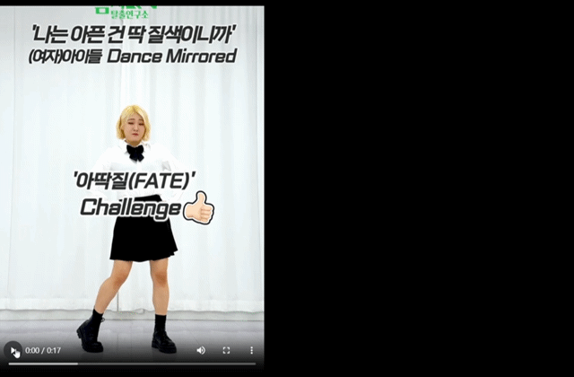

- 랜드마크의 좌표값 스케일을 정규화  
  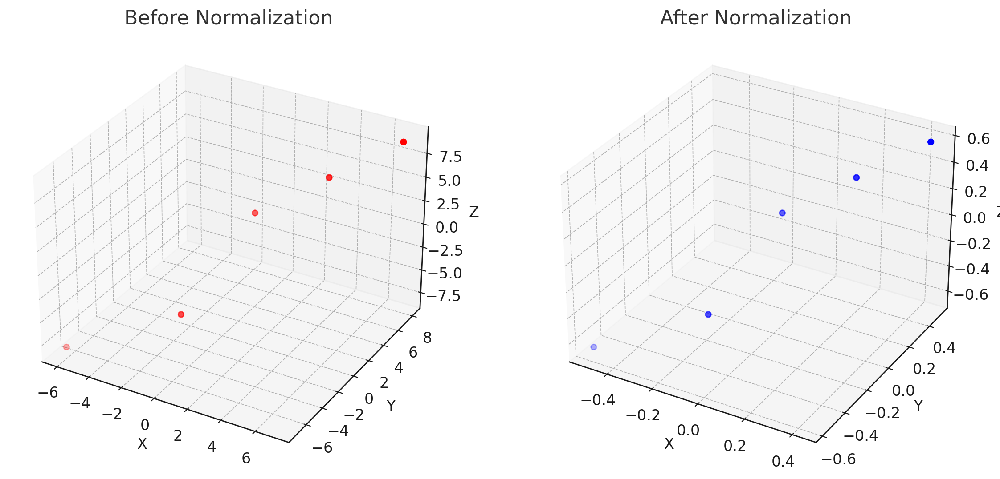

- 정규화된 값을 바탕으로 코사인 유사도 실행 -> 결과값을 바탕으로 유사도 비교  
  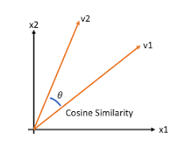
  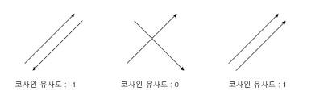

#### 반응형 웹 디자인

숏토리얼은 언제 어디서나 춤 연습을 할 수 있는 환경을 제공하고자 했습니다.  
그래서 어떤 디바이스에서도 원활하게 사용할 수 있도록 반응형 웹으로 개발했습니다.

- 기기의 방향을 감지하여 연습/챌린지 모드에서 보이는 화면을 최적화함
- 연습 모드
  - 세로 - 원본 영상
  - 가로 - 원본 영상과 카메라
- 챌린지 모드

  - 세로 - 카메라
  - 가로 - 원본 영상과 카메라

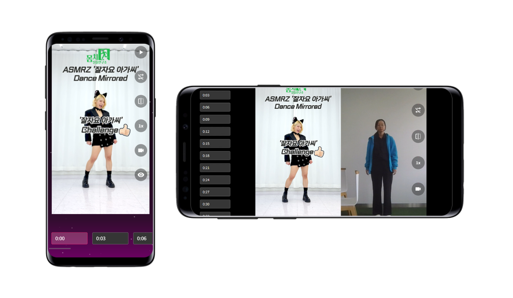

#### FFmpeg

- 비디오, 오디오, 이미지를 쉽게 인코딩, 디코딩 할 수 있도록 도움을 주는 멀티미디어 프레임워크
- 녹화 후에 음악을 입히고 좌우 반전한 동영상을 반환함
